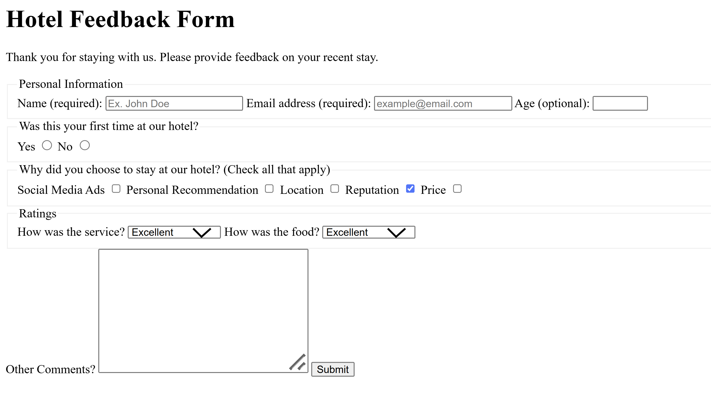

# 🎉 Hotel Feedback Form

📝 **Description**
Hotel Feedback Form is a simple HTML5-based web page that allows guests to provide feedback on their hotel stay. Built with semantic HTML, it promotes accessibility, clarity, and a clean structure. This project is ideal for beginners learning to organize forms and content using standard web elements.

🖼️ **Preview**


🛠️ **Technologies Used**
- **HTML5** – Semantic structure (`<header>`, `<main>`, `<form>`, `<fieldset>`, `<legend>`, `<label>`, `<input>`, `<textarea>`, `<button>`)
- **Form Elements** – For collecting user feedback
- **Static Image** – Local preview screenshot

📂 **Project Structure**
```
HotelFeedbackForm/
├── img/
│   └── htmlPageScreenShot.png
├── index.html
└── README.md
```

📜 **Main Components**
- **index.html**
  - Header with site title and introduction
  - Main form with:
    - Personal information fields
    - Radio buttons and checkboxes for feedback
    - Ratings dropdowns
    - Comments textarea
    - Submit button

🚀 **Features**
- 📑 Semantic and accessible HTML structure
- 📝 User-friendly feedback form
- 🖼️ Integrated static preview image
- ✍️ Clear content formatting for easy readability

🔧 **Possible Improvements**
- Add CSS for improved visual appearance
- Make the layout responsive for mobile and tablets
- Integrate with a backend to store feedback
- Add form validation and confirmation messages

👤 **Author**
Ralph Christian Gabriel  
Passionate about learning and building user-friendly web applications.

📜 **License**
This project is open-source and available under the MIT License.
